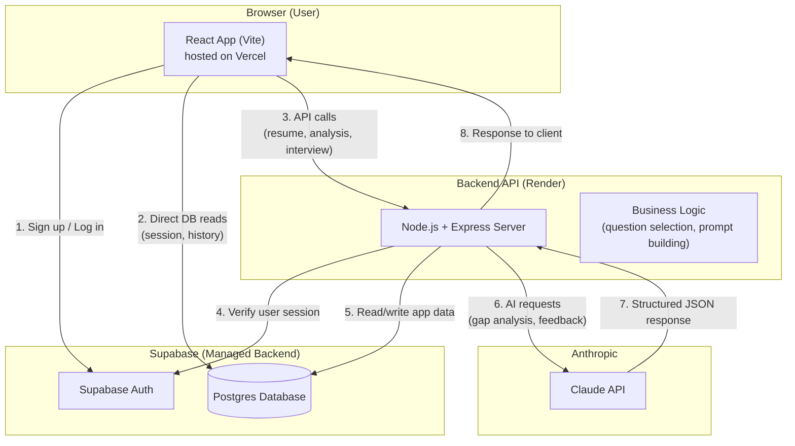
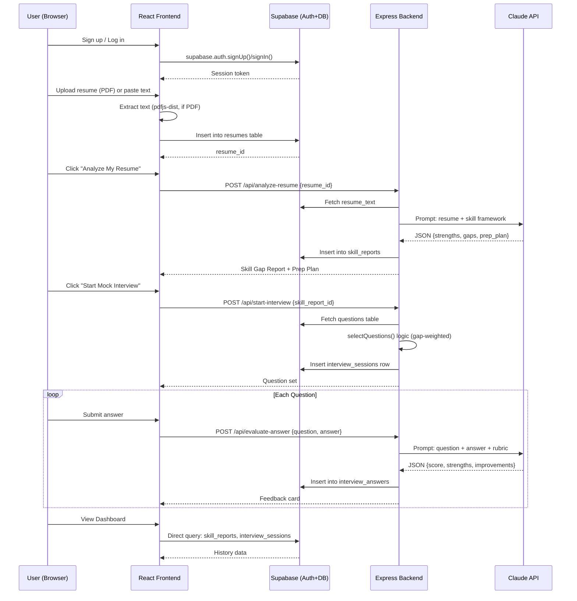
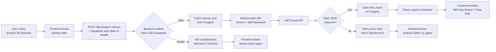

# System Architecture — AI Career & Interview Copilot

Version 1.0 | Day 2 Design Output | Source of truth: PRD.docx, Implementation_Blueprint_Days2-10.md

---

## 1. Tech Stack Summary

| Layer | Technology |
|---|---|
| Frontend | React (Vite) |
| Backend API | Node.js + Express |
| Database | Supabase (Postgres) |
| Authentication | Supabase Auth (email/password) |
| AI Model | Anthropic Claude API |
| Frontend Hosting | Vercel |
| Backend Hosting | Render (free web service) |

---

## 2. Component Diagram



**Design note:** The frontend talks to Supabase **directly** for simple auth and read operations (login state, fetching dashboard history) — this is standard practice with Supabase's client library and reduces backend complexity. The frontend talks to the **Express backend** only for operations that require the LLM API key (which must never be exposed client-side) — resume analysis, question selection, and answer feedback. This split keeps the backend small and focused only on what truly needs a server.

---

## 3. Data Flow — Full Core Loop



---

## 4. Request Lifecycle — Example: "Analyze My Resume"



---

## 5. AI Interaction Design

Two distinct AI calls exist in v1.0, both using the Claude API with **strict JSON-only prompting**:

| Call | Trigger | Input | Output Shape |
|---|---|---|---|
| **Resume Analysis** | User clicks "Analyze My Resume" | Resume text + fixed SDE Intern skill framework | `{ strengths: [], gaps: [{topic, why, priority}], prep_plan: [{topic, action, priority}] }` |
| **Answer Feedback** | User submits an interview answer | Question text + question type + user's answer | `{ score: 1-10, strengths: [max 3], improvements: [max 3] }` |

**Reliability safeguards (both calls):**
- System prompt explicitly instructs "return raw JSON only, no markdown fences, no preamble text."
- Backend strips any accidental ` ```json ` fences before parsing, as a safety net.
- If `JSON.parse()` fails, the backend retries the call once before surfacing a friendly error to the user (per Request Lifecycle diagram above).
- Both calls are stateless from Claude's perspective — no conversation history is sent, which keeps prompts small, fast, and predictable.

---

## 6. External Services

| Service | Purpose | Tier |
|---|---|---|
| Supabase | Auth + Postgres database | Free |
| Anthropic Claude API | Resume analysis + answer feedback | Existing key (pay-as-you-go, low volume expected) |
| Vercel | Frontend hosting + CI from GitHub | Free (Hobby) |
| Render | Backend (Express) hosting | Free (Web Service) |
| GitHub | Version control, triggers deploys | Free |

---

## 7. Security Notes (v1.0 scope)

- The Claude API key lives **only** in the backend's environment variables (Render dashboard) — never shipped to the browser.
- Supabase's public `anon` key is safe to expose in the frontend by design (Supabase's model), but all table access is protected by **Row Level Security (RLS) policies** restricting each user to their own rows.
- Passwords are never handled directly by our code — Supabase Auth manages hashing and storage entirely.
