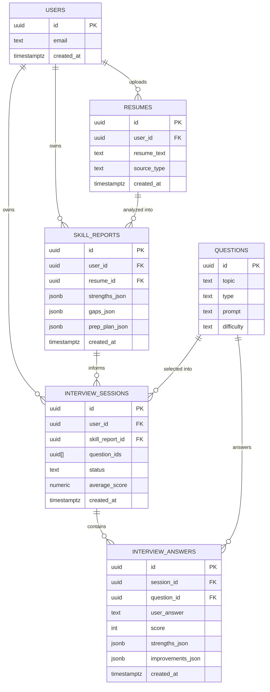

# Database Schema — AI Career & Interview Copilot

Version 1.0 | Day 2 Design Output | Database: Supabase (Postgres)

---

## 1. Entity Relationship Diagram



**Note:** `USERS` is Supabase's built-in `auth.users` table — we do not create it ourselves. All other tables reference it via `user_id`.

---

## 2. Table Definitions

### `resumes`
Stores each resume a user submits (upload or paste).

| Field | Type | Constraints |
|---|---|---|
| `id` | uuid | Primary key, default `gen_random_uuid()` |
| `user_id` | uuid | Foreign key → `auth.users.id`, not null |
| `resume_text` | text | Not null — extracted or pasted text |
| `source_type` | text | Not null — `'pdf'` or `'paste'` |
| `created_at` | timestamptz | Default `now()` |

---

### `skill_reports`
Stores the AI-generated Skill Gap Report and Prep Plan for a given resume.

| Field | Type | Constraints |
|---|---|---|
| `id` | uuid | Primary key, default `gen_random_uuid()` |
| `user_id` | uuid | Foreign key → `auth.users.id`, not null |
| `resume_id` | uuid | Foreign key → `resumes.id`, not null |
| `strengths_json` | jsonb | Not null — array of strength strings |
| `gaps_json` | jsonb | Not null — array of `{topic, why, priority}` |
| `prep_plan_json` | jsonb | Not null — array of `{topic, action, priority}` |
| `created_at` | timestamptz | Default `now()` |

---

### `questions`
Static/curated question bank (seeded once, editable via Supabase dashboard — no redeploy needed to update content).

| Field | Type | Constraints |
|---|---|---|
| `id` | uuid | Primary key, default `gen_random_uuid()` |
| `topic` | text | Not null — one of the fixed skill-framework topics (e.g. `'DSA'`, `'OOP'`, `'System Design'`, `'Databases'`, `'Git'`, `'Web Fundamentals'`) |
| `type` | text | Not null — `'conceptual'` or `'coding_review'` |
| `prompt` | text | Not null — the question text shown to the user |
| `difficulty` | text | Not null — `'easy'`, `'medium'`, or `'hard'` |

*No `user_id` — this table is shared/global content, not user-owned.*

---

### `interview_sessions`
One row per mock interview a user starts.

| Field | Type | Constraints |
|---|---|---|
| `id` | uuid | Primary key, default `gen_random_uuid()` |
| `user_id` | uuid | Foreign key → `auth.users.id`, not null |
| `skill_report_id` | uuid | Foreign key → `skill_reports.id`, not null |
| `question_ids` | uuid[] | Not null — ordered array of selected question IDs |
| `status` | text | Not null — `'in_progress'` or `'completed'`, default `'in_progress'` |
| `average_score` | numeric | Nullable — filled in when status becomes `'completed'` |
| `created_at` | timestamptz | Default `now()` |

---

### `interview_answers`
One row per answered question within a session.

| Field | Type | Constraints |
|---|---|---|
| `id` | uuid | Primary key, default `gen_random_uuid()` |
| `session_id` | uuid | Foreign key → `interview_sessions.id`, not null |
| `question_id` | uuid | Foreign key → `questions.id`, not null |
| `user_answer` | text | Not null |
| `score` | int | Not null, check `score >= 1 and score <= 10` |
| `strengths_json` | jsonb | Not null — array of up to 3 strings |
| `improvements_json` | jsonb | Not null — array of up to 3 strings |
| `created_at` | timestamptz | Default `now()` |

---

## 3. Row Level Security (RLS) Policy Summary

All user-owned tables (`resumes`, `skill_reports`, `interview_sessions`, `interview_answers`) require RLS policies so a user can only read/write their **own** rows:

```sql
-- Example pattern, applied per table
create policy "Users manage their own rows"
on resumes
for all
using (auth.uid() = user_id)
with check (auth.uid() = user_id);
```

For `interview_answers`, since it references `session_id` rather than `user_id` directly, the policy checks ownership via a join:

```sql
create policy "Users manage their own answers"
on interview_answers
for all
using (
  auth.uid() = (select user_id from interview_sessions where id = session_id)
);
```

The `questions` table is **publicly readable** (no RLS restriction needed) since it's shared content, but **not writable** by regular users (only editable via the Supabase dashboard/service role).

---

## 4. Schema Validation Against PRD User Stories

| PRD Core Loop Step | Supported By |
|---|---|
| User creates account / logs in | `auth.users` (Supabase built-in) |
| User uploads/pastes resume | `resumes` |
| AI generates Skill Gap Report | `skill_reports.strengths_json`, `skill_reports.gaps_json` |
| AI generates Prep Plan | `skill_reports.prep_plan_json` |
| Mock interview selects relevant questions | `questions` (tagged by topic) + `interview_sessions.question_ids` |
| User answers questions | `interview_answers.user_answer` |
| AI gives structured feedback per answer | `interview_answers.score/strengths_json/improvements_json` |
| User revisits past prep plans and attempts (Saved History) | Query `skill_reports` and `interview_sessions` filtered by `user_id`, ordered by `created_at` |

Every core-loop step from the PRD maps to a concrete table/field — no gaps identified. No schema changes needed before implementation begins.
