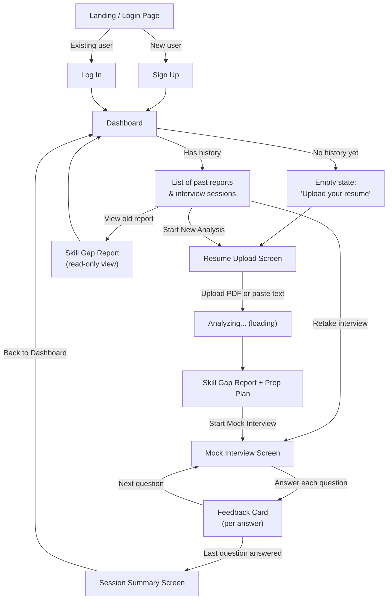
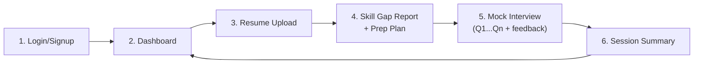

# UI & User Flow — AI Career & Interview Copilot

Version 1.0 | Day 2 Design Output | Low-fidelity wireframes (ASCII) + flow diagrams

---

## 1. User Flow Diagram



---

## 2. Screen Inventory (every screen exists for a reason)

| # | Screen | Purpose | Reachable From |
|---|---|---|---|
| 1 | Login | Authenticate returning users | Landing |
| 2 | Sign Up | Create a new account | Landing |
| 3 | Dashboard | Home base — shows history or prompts first action | Login/Signup success, Nav bar |
| 4 | Resume Upload | Capture resume (PDF or paste) | Dashboard ("Start New Analysis") |
| 5 | Skill Gap Report + Prep Plan | Show AI analysis, entry point to interview | After analysis completes, or from Dashboard history |
| 6 | Mock Interview | Question-by-question practice | From Report screen, or Dashboard ("Retake Interview") |
| 7 | Feedback Card (inline, not a separate route) | Show per-answer AI feedback | Appears after each interview answer |
| 8 | Session Summary | Aggregate results at end of interview | After last question in a session |

No screen exists without a clear entry point and a clear next action — matches the PRD's core loop exactly, with the Dashboard as the only "hub" screen.

---

## 3. Screen Flow (linear core path)



---

## 4. Navigation

- **Persistent top nav bar** on every screen after login: app name/logo (left), "Dashboard" link, "Logout" button (right).
- No nav bar on Login/Signup screens (keeps focus on the auth action).
- Back-navigation within the interview flow is intentionally **not supported** (per Blueprint Day 6 — decided to keep session state simple, avoid re-answering confusion). A "Session in progress" indicator will warn the user if they try to navigate away mid-interview.

---

## 5. Low-Fidelity Wireframes

### 5.1 Login / Sign Up
```
┌─────────────────────────────────────────┐
│                                           │
│      AI Career & Interview Copilot       │
│                                           │
│   ┌───────────────────────────────┐     │
│   │  Email                        │     │
│   └───────────────────────────────┘     │
│   ┌───────────────────────────────┐     │
│   │  Password                     │     │
│   └───────────────────────────────┘     │
│                                           │
│         [   Log In   ]                   │
│                                           │
│   Don't have an account? Sign Up →       │
│                                           │
└─────────────────────────────────────────┘
```

### 5.2 Dashboard (empty state)
```
┌─────────────────────────────────────────────────┐
│ Copilot        Dashboard          Logout          │
├─────────────────────────────────────────────────┤
│                                                    │
│      Welcome! You haven't analyzed a resume       │
│                  yet.                             │
│                                                    │
│          [ Upload Your Resume → ]                 │
│                                                    │
└─────────────────────────────────────────────────┘
```

### 5.3 Dashboard (populated)
```
┌─────────────────────────────────────────────────┐
│ Copilot        Dashboard          Logout          │
├─────────────────────────────────────────────────┤
│  [ + Start New Analysis ]                          │
│                                                    │
│  Past Reports                                     │
│  ┌───────────────────────────────────────────┐   │
│  │ Aug 20  |  Gaps: System Design, SQL         │   │
│  │  [ View Report ]  [ Retake Interview ]      │   │
│  └───────────────────────────────────────────┘   │
│  ┌───────────────────────────────────────────┐   │
│  │ Aug 15  |  Avg Score: 7.4/10                │   │
│  │  [ View Report ]  [ Retake Interview ]      │   │
│  └───────────────────────────────────────────┘   │
└─────────────────────────────────────────────────┘
```

### 5.4 Resume Upload
```
┌─────────────────────────────────────────────────┐
│ Copilot        Dashboard          Logout          │
├─────────────────────────────────────────────────┤
│           Upload Your Resume                      │
│                                                    │
│   ┌─────────────────────────────────────────┐    │
│   │   Drag & drop a PDF, or click to browse   │    │
│   └─────────────────────────────────────────┘    │
│                                                    │
│         — or —                                    │
│                                                    │
│   [ Paste your resume text instead ]              │
│                                                    │
│              [ Analyze My Resume ]                 │
└─────────────────────────────────────────────────┘
```

### 5.5 Skill Gap Report + Prep Plan
```
┌─────────────────────────────────────────────────┐
│ Copilot        Dashboard          Logout          │
├─────────────────────────────────────────────────┤
│  Skill Gap Report                                  │
│  ┌───────────────────┐  ┌───────────────────┐    │
│  │ ✓ Strengths        │  │ ⚠ Gaps             │    │
│  │ - OOP fundamentals │  │ - System Design(H) │    │
│  │ - Git basics       │  │ - SQL (M)          │    │
│  └───────────────────┘  └───────────────────┘    │
│                                                    │
│  Your Prep Plan                                    │
│  1. [High] Study system design basics              │
│  2. [Med]  Practice SQL queries                    │
│                                                    │
│         [ Start Mock Interview → ]                 │
└─────────────────────────────────────────────────┘
```

### 5.6 Mock Interview (question in progress)
```
┌─────────────────────────────────────────────────┐
│ Copilot        Dashboard          Logout          │
├─────────────────────────────────────────────────┤
│  Question 3 of 7           [███████░░░░░░]        │
│                                                    │
│  "Explain the difference between vertical         │
│   and horizontal scaling."                         │
│                                                    │
│   ┌─────────────────────────────────────────┐    │
│   │ Type your answer here...                  │    │
│   │                                            │    │
│   └─────────────────────────────────────────┘    │
│                                                    │
│              [ Submit Answer ]                     │
└─────────────────────────────────────────────────┘
```

### 5.7 Feedback Card (shown after submitting an answer)
```
┌─────────────────────────────────────────────────┐
│  Score: 7 / 10                                     │
│                                                    │
│  Strengths                                         │
│  • Correctly identified the core trade-off         │
│  • Clear explanation structure                     │
│                                                    │
│  Areas to Improve                                  │
│  • Missing discussion of time complexity           │
│  • Could mention an alternative approach            │
│                                                    │
│              [ Next Question → ]                   │
└─────────────────────────────────────────────────┘
```

### 5.8 Session Summary
```
┌─────────────────────────────────────────────────┐
│ Copilot        Dashboard          Logout          │
├─────────────────────────────────────────────────┤
│         Interview Complete!                        │
│                                                    │
│         Average Score: 7.2 / 10                    │
│                                                    │
│  Q1  System Design      Score: 8                   │
│  Q2  DSA (coding)       Score: 6                   │
│  Q3  SQL                Score: 7                   │
│  ...                                               │
│                                                    │
│           [ Back to Dashboard ]                     │
└─────────────────────────────────────────────────┘
```

---

## 6. Design Notes for Day 3+ Implementation

- Wireframes are intentionally low-fidelity — visual styling (colors, spacing, component library choices) happens during the Day 7 polish pass per the Blueprint, not before.
- Every screen maps directly to a React route/component named consistently with `PROJECT-STRUCTURE.md`.
- The Feedback Card is a **component**, not a route — it renders inline within the Mock Interview screen, matching the Blueprint's Day 6 plan.
